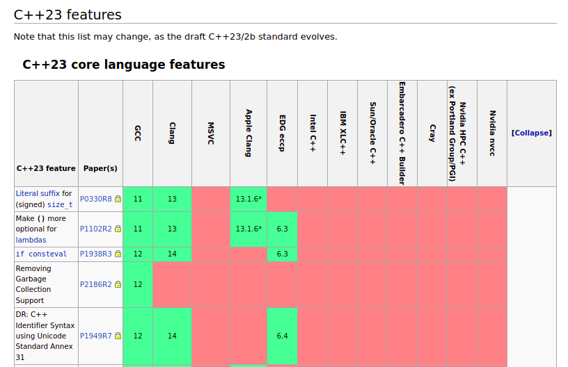
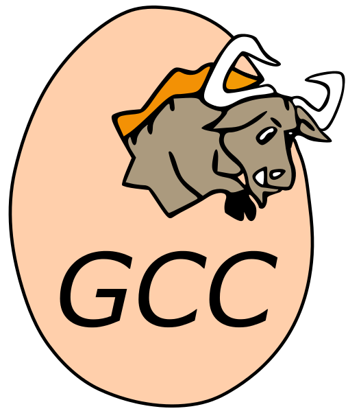

#C++

#C++ Compiler Support

https://en.cppreference.com/w/cpp/compiler_support

# GNU GCC

## GNU's Not Unix's Compiler Collection

## GNU

https://www.gnu.org/

GNU is a recursive acronym for "GNU's Not Unix!". GNU is an extensive collection of free software (383 packages as of January 2022), which can be used as an operating system or can be used in parts with other operating systems. The use of the completed GNU tools led to the family of operating systems popularly known as Linux. Most of GNU is licensed under the GNU Project's own General Public License (GPL).

# GCC

https://gcc.gnu.org/

The GNU Compiler Collection includes front ends for C, C++, Objective-C, Fortran, Ada, Go, and D, as well as libraries for these languages (libstdc++,...). GCC was originally written as the compiler for the GNU operating system. The GNU system was developed to be 100% free software, free in the sense that it respects the user's freedom.

